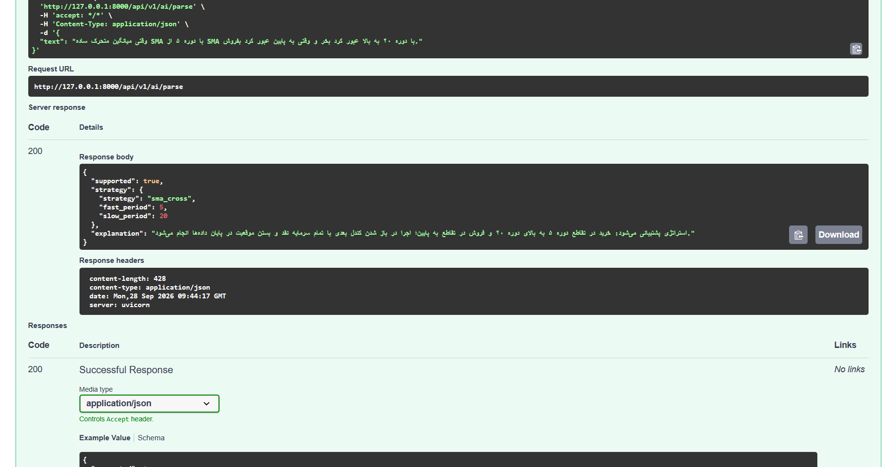
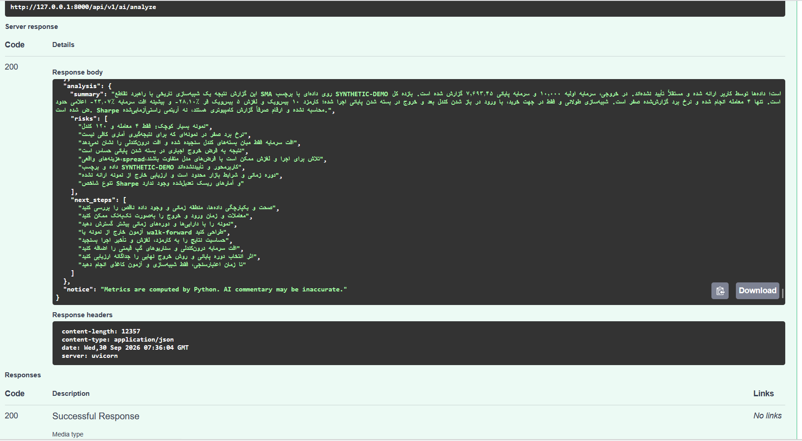
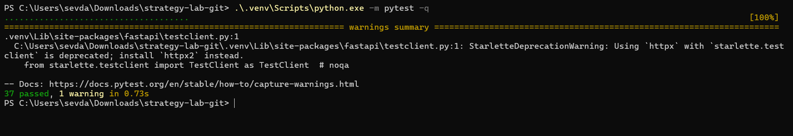

# Strategy Lab

An independent Python portfolio project: a long-only SMA crossover backtesting API.
Not affiliated with SetupTrack. Version 0.2 is an educational MVP, not a trading platform.

## What works

- FastAPI endpoints, interactive `/docs`, typed input validation.
- Optional APMIX Luna: Persian backtest commentary and validated SMA strategy drafts.
- SMA cross signals calculated using completed candle closes.
- Execution at the **next candle open**, including configurable fees and adverse slippage.
- Trade ledger, equity curve, net return, closed-trade win rate and close-to-close maximum drawdown.
- Hand-calculated engine tests and API validation tests; GitHub Actions workflow.
- Dockerfile and deterministic synthetic example data (not historical market data).

## Run locally (Python 3.11+)

```bash
python -m venv .venv
```

Activate on Windows PowerShell:

```powershell
.\.venv\Scripts\Activate.ps1
```

Or on Linux/macOS:

```bash
source .venv/bin/activate
```

Then:

```bash
python -m pip install -r requirements-dev.txt
python -m pytest -q
python -m uvicorn app.main:app --reload
```

Open http://127.0.0.1:8000/docs. Select `POST /backtests`, click **Try it out**, paste
`examples/request.json`, then **Execute**. Alternatively, in another terminal:

```bash
curl -X POST http://127.0.0.1:8000/backtests -H "Content-Type: application/json" --data-binary @examples/request.json
```

On Windows use `curl.exe` instead of `curl`.

## Optional Luna layer

See [Windows / Persian setup](START_HERE_FA.md). Copy `.env.example` to `.env`,
set your own `APMIX_API_KEY`, and keep `APMIX_MODEL=gpt-5.6-luna` unless your
account requires a different identifier. Never commit `.env`.

| Endpoint | Input | Behavior |
| --- | --- | --- |
| POST `/backtests` or `/api/v1/strategies/backtest` | `examples/request.json` | Python-only backtest; no API credits |
| POST `/api/v1/ai/parse` | `{"text":"Buy on SMA5 crossing above SMA20; sell on the reverse cross"}` | Validated strategy draft; review before use |
| POST `/api/v1/ai/analyze` | `examples/request.json` | Python backtest plus Persian AI commentary |

AI requests use `https://api.apmix.ai/v1/chat/completions` with Bearer authentication,
a 60-second HTTP operation timeout, a 1,800-token output budget and no automatic
retries. `httpx` transport is mocked in tests; no real credits are consumed.
The adapter uses standard Chat Completions fields, not provider-specific structured
output features. Malformed, truncated and schema-invalid output is rejected.
Provider errors are sanitized; neither raw provider responses nor keys are logged.

Only a validated summary and assumptions are sent for analysis; raw candles,
trades and equity series stay local. Parse sends the user's strategy text.
Metrics stay separate from AI commentary and are never calculated by the model.
The parser currently supports **only SMA crossover** and is instructed to reject
unsupported or ambiguous conditions. Schema validation cannot guarantee semantic
faithfulness: users must review the draft. Nothing is automatically executed and
no generated code is evaluated. No production authentication or spend controls
are included: bind to localhost. APMIX account access is required for live AI use;
without a key, the ordinary backtest still works. Live provider compatibility
and Windows execution must be checked on the user's machine; automated validation
here uses mocked HTTP on Linux.

Provider references: https://apmix.ai/models/gpt-5.6-luna and https://apmix.ai/docs

## Docker

```bash
docker build -t strategy-lab .
docker run --rm -p 127.0.0.1:8000:8000 strategy-lab
# Optional AI (after creating .env):
docker run --rm --env-file .env -p 127.0.0.1:8000:8000 strategy-lab
```

## Design

`app/models.py` validates data; `app/engine.py` implements the pure simulation;
`app/main.py` exposes it over HTTP. Results are not persisted yet.

A positive SMA difference after a nonpositive difference schedules a buy; the
opposite crossing schedules a sell. The initial SMA observation does not trigger
an entry. Positions invest all available cash with fractional units, no leverage
and no short selling. Fees apply on both entry and exit; 10 bps equals 0.1%.
The final position is forcibly closed at the last close with fees and slippage;
this is reported as `end_of_data`. Last-bar signals are ignored.

Equity is marked at candle closes, and drawdown includes initial capital as its
first peak. Drawdown is returned as a nonpositive percentage. Win rate is null
when there are no closed trades. Breakeven trades are not wins. No annualized
Sharpe is reported because bar frequency and risk-free-rate assumptions are not
specified. Gaps are accepted: “next open” means the next supplied candle.

Limits: maximum 10,000 candles/request; no liquidity, volume constraints, spread
model beyond slippage, intrabar drawdown, dividends, corporate actions, funding,
margin or taxes. Float arithmetic is appropriate for this prototype, not exchange
accounting. No authentication, request-body byte limit, rate limiting or persistence:
run locally; do not expose publicly as a production service.

## Learning roadmap

1. Explain request validation and the next-open fill test in your own words.
2. Add CSV ingestion with timezone and duplicate validation.
3. Add PostgreSQL persistence, SQLAlchemy and Alembic migrations.
4. Add EMA/RSI as separately tested strategies.
5. Extend the existing Luna adapter with additional strategies only after engine support exists.
6. Add authentication, background jobs, limits and deployment configuration.
7. Add reproducible historical datasets and out-of-sample evaluation.

## Get the project from GitHub

```bash
git clone https://github.com/CodeNomadSV/strategy-lab.git
cd strategy-lab
```

Then follow the local setup above. Read `START_HERE_FA.md` for the Persian guide.

## References

- https://fastapi.tiangolo.com/tutorial/testing/
- https://docs.python.org/3/library/venv.html

## Screenshots

### Natural-language strategy parsing
Persian input converted into validated SMA crossover parameters.



### Backtest and AI analysis
Python computes the metrics; the language model provides commentary.
This example uses synthetic data.



### Automated tests on Windows
37 tests passed.

